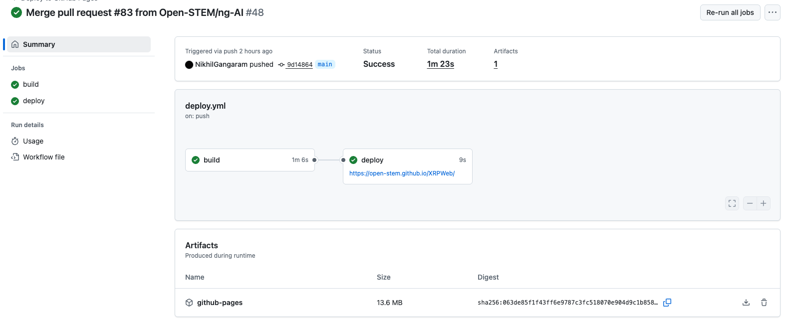

# XRPWeb Release Instructions

## Overview

The following is the instructions to manually public a XRPWeb and XRPCodeAPI release. The XRPWeb and XRPCodeAPI can release seperately, but the initial release must be deployed at the sametime for the AI Chat feature to work.

## Create a release in Github

To create a manual release in Github for each repository, following the instructions below.

### XRPWeb

The XRPWeb's build and deploy actions will run whenever a commit is merge to the main branch. As part of the build process, a build artifact is generated. This artifact is deploy to the Github pages. The artifact is called github-pages. This is a tar file which contains the vite build output. See an example here.

- Open a browser and navigate to Open-STEM / 
- push a new tag
- If a new build is required, click the Actions tab
- Select a latest pages build and deployment action, and click the "Re-run all jobs" button on top of the right hand side of the page
- after the build and deployment jobs is completed, you can click the download button of the page to download the artifact to your local computer
- Click the XRPWeb main repository page
- Click the "Create a new release" link
- Select the tag that you push in earlier step
- Enter a title of the release and enter a description
- attach the artifact that you just download
- Click the "Set as a pre-release" checkbox if this apply
- Click the "Publish release" button

### XRPCodeAPI

- push a new tag
- Click the XRPCodeAPI main repository page
- Click the "Create a new release" link
- Select the tag that you push in earlier step
- Enter a title of the release and enter a description
- Click the "Set as a pre-release" checkbox if this apply
- Click the "Publish release" button

## Deploying releases

The XRPWeb and XRPCodeAPI releases needs to be deploy to a server that can host Web servers, i.e., Apache HTTP Web server for example.

- Upload the XRPWeb release artifact to the server
- Extract the artifact tar file to the local server folder
- Copy recursively the folder content to /var/www/html folder (Apache Web server only)
- For Fedora, ensure SELinx permissions are set properly

The XRPCodeAPI backend has a install.sh file.

- Upload the XRPCodeAPI release artifact to the server
- Extract the artifact to a local folder on the server
- Run the install.sh file
- Setup the HTTP proxy in the Apache Webserver to route external traffic to the XRPCodeAPI backend
- Setup SELinx port permission
