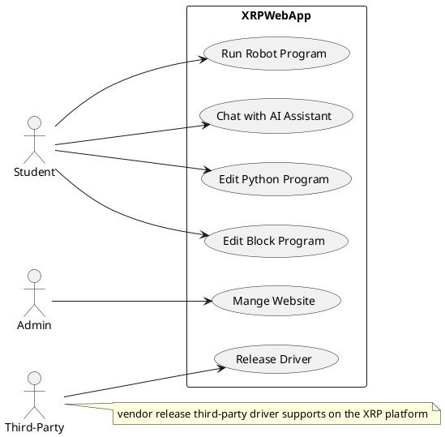
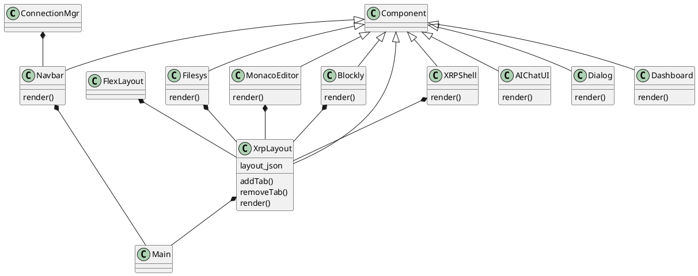
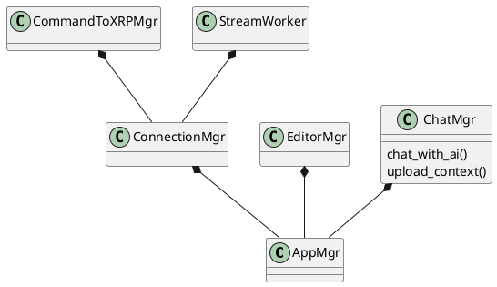
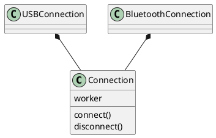
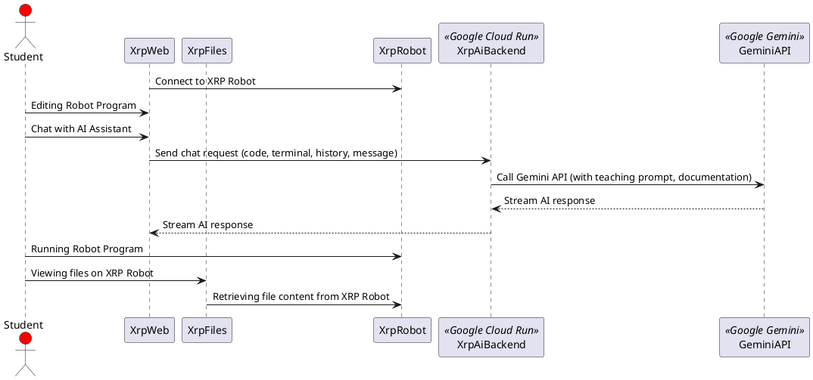

# Introduction

XRP ofers a flexible and adaptable platform that allows students to learn about robotics, programming, and engineering concepts at their own pace and it also enables STEM education accessible to a wider range of students, regardless of their background or location.

In addition, the goals are to inspire and empower young people to pursue careers in STEM fields through hands-on, engaging robotics experiences. Encourage students to work together to solve challenges and develop innovative solutions and an cooperative environment where students can fosther grow individually and professionally.

The student uses this Web application platform along with the XRP Robot to perform their programming, troubleshooting and experimentation tasks.

## Scope

Sparkfun manages the development of the XRP controller board in collaboration with WPI and community volunteers. The XRP Web application is a collaboration between WPI and community volunteers. This document describes the software architecture of the XRP software platform including both the Web application and the firmware release to the XRP hardware platform. 

# Software Architecture

## Quality Attributes

The software architecture intends to focus on the following architecture principles.

- Maintainability
- Testability
- Extendability
- Adaptability
- Developability

## Constraints

The XRP software architecture shall embrace the software component design patterns and declarative user interface paradigm to enhance code readability and maintainability.

The XRP platform is an Open Source and it is not a for profit software product. The development environment leverages mostly Open Source software development tools such as Visual Studio Code and Micro Python and Open Source software libraries.

Vite and React can satisfy both the software component design pattern and declarative user interface design paradigm.

## Use Cases

The diagram below depicts the use cases for the XRP Web Development Application.



## AI Assistant (XRP Code Buddy)

The XRP Web Development Application integrates an educational AI Assistant, "XRP Code Buddy," powered by the Gemini API. This assistant is designed to guide students through robotics programming challenges using best teaching practices rather than simply providing solutions.

### AI Interaction Workflow

1.  **Initialization**: The `XRPCodeBuddy` backend component is initialized with the Gemini API key (securely stored as an environment variable) and configured with safety settings. XRP robotics documentation is loaded once on startup and provided to Gemini as foundational context.
2.  **Student Interaction**: When a student sends a message to the AI bot from the frontend:
    *   The frontend sends the student's message, the current editor content, recent terminal output, and the conversation history to the backend.
    *   The backend's `XRPCodeBuddy` component dynamically constructs a comprehensive "teaching prompt." This prompt embeds:
        *   Core teaching philosophy and graduated response framework (Hint, Concept, Pseudocode, Example, Solution).
        *   Guidelines for integrating documentation, providing code snippets, and fostering intuitive explanations.
        *   Contextual information: the student's current code, recent terminal output, and a reference to the pre-loaded XRP documentation.
        *   The complete conversation history for continuity.
    *   The backend securely calls the Gemini API with this enriched prompt.
    *   Gemini generates a streaming response, adhering to the provided teaching guidelines.
    *   The backend streams Gemini's response back to the frontend.
3.  **Secure API Key Management**: The backend acts as a secure proxy, ensuring the Gemini API key is never exposed to the client-side frontend application.

## Technology

This software architecture specifies the following technology stack for development.

- Vite Development framework and React User Interface framework
- Typescript programming language
- HTML/CSS (Tailwindcss)
- Web browser serial protocol
- JSON
- Bluetooth (BLE) protocol
- HTTPS protocol
- Python (FastAPI) for AI Backend
- Google Gemini API for AI functionalities

## Context

Experiemential Robotics Platform (XRP) is a learning platform consists of the XRP hardware that is based on Sparkfun's [controller](https://www.sparkfun.com/products/22727) board and XRP software development environment for writing software for the XRP.

```plantuml
@startuml "enterprise"
!include https://raw.githubusercontent.com/plantuml-stdlib/C4-PlantUML/master/C4_Context.puml
' uncomment the following line and comment the first to use locally
' !include C4_Context.puml

LAYOUT_TOP_DOWN()
'LAYOUT_AS_SKETCH()
LAYOUT_WITH_LEGEND()

Person(user, "User", "XRP user, typically a student.")

Enterprise_Boundary(c0, "XRP") {
    Person(csa, "XRP Admin", "XRP Web Administrator")

    System(xrpdev, "XRP Web App", "Allow XRP users to write robotics program for the XRP on the XRP website.")
    System(xrp_ai_backend, "XRP AI Backend", "Securely proxies AI requests and provides educational context to Gemini API.")
}

System(XRPBot, "XRP Robot", "XRP Hardware platform.")
System_Ext(gemini_api, "Gemini API", "Google's AI model for generative responses")

Rel_R(user, csa, "Asks questions to", "Email, Discord")

Rel_R(user, xrpdev, "develope software for the XRP and interacts with AI.")

Rel_R(user, XRPBot, "student run software on the XRP robot")

Rel(csa, xrpdev, "manage XRP Web deployment and maintainance of XRPWeb")
Rel(csa, xrp_ai_backend, "manage XRP AI Backend deployment and API key configuration")

Rel_R(xrpdev, XRPBot, "Update XRP or Run the robot program")
Rel_R(xrpdev, xrp_ai_backend, "sends AI chat requests to", "HTTPS/JSON")
Rel_R(xrp_ai_backend, gemini_api, "makes generative model calls to", "HTTPS")

@enduml
```

## Containers

The XRP hardware platform is a afordable hardware kit that consists of the following components. The kit is retail for $114.95. Sparkfun.com offers discount to FIRST teams.

- Sparkfun [controller](https://www.sparkfun.com/products/22727) board
- XRP chassis set
- Ultrasounic Distance Sensor
- Servo (sub-micro size)
- Hobby Motor with encoder
- Caster wheel
- O-Ring
- flexible Qwiic Cable - Female Jumper (4-pin) with Heat Shrink
- Battery holder
- Custom Line Follower board
- XRP Sticker Sheet

```plantuml
@startuml "messagebus"
!include https://raw.githubusercontent.com/plantuml-stdlib/C4-PlantUML/master/C4_Container.puml

SHOW_PERSON_OUTLINE()

Person(user, "User", "XRP user, typically a student.")

System_Boundary(c1, "XRP Platform") {
    Container(xrp, "XRP Platform", "XRP Hardware", "Allows users to experiement the XRP platform")
    Container(xrp_kernel, "XRP Kernel", "XRP Micro-Python", "Provides an OS and runtime environment")
    Container(xrp_motion, "XRP Actuators", "XRP motion hardware", "Provides mechanical motion capability")
    Container(xrp_sensors, "XRP Sensors", "XRP sensing capability", "Provides sensing capability to enhance the robot")
    Container(xrp_power, "XRP Battery Pack", "XRP power", "Provides power to the platform")
}

SHOW_LEGEND()
@enduml
```

The XRP software platform (XRP Web development environment) provides the students environment where they can write robot program in block or Python programs.

```plantuml
@startuml
@startuml
!include https://raw.githubusercontent.com/plantuml-stdlib/C4-PlantUML/master/C4_Container.puml
!define DEVICONS https://raw.githubusercontent.com/tupadr3/plantuml-icon-font-sprites/master/devicons
!define FONTAWESOME https://raw.githubusercontent.com/tupadr3/plantuml-icon-font-sprites/master/font-awesome-5

LAYOUT_WITH_LEGEND()

Person(user, "User", "XRP user, typically a student.")
Person(csa, "XRP Admin", "XRP Web Administrator")

title Container diagram for XRP Web

System_Boundary(c1, "XRP Web IDE") {
    Container(web_app, "Web Application", "Typescript, React", "Provides an interactive environment to develop robot program and interact with the AI assistant.")
    Container(ai_backend, "AI Backend", "Python, FastAPI, XRPCodeBuddy", "Securely proxies AI requests to Gemini, manages API key, and provides educational context.")
}

System_Ext(xrp, "XRP Platform", "The XRP Robot Platform")
System_Ext(gemini_api, "Gemini API", "Google's AI model for generative responses")

Rel(user, web_app, "uses", "HTTPS")
Rel(csa, web_app, "uses", "HTTPS")
Rel(web_app, ai_backend, "sends AI chat requests to", "HTTPS/JSON")
Rel(ai_backend, gemini_api, "makes generative model calls to", "HTTPS")
Rel_D(web_app, xrp, "", "")

@enduml
```

## Components

The software components are the major features of the system where they are grouped distintively and their relationship between components are specified. Each component can be developed independently and each have interface specification between them.

```plantuml
@startuml
!include https://raw.githubusercontent.com/plantuml-stdlib/C4-PlantUML/master/C4_Component.puml
' uncomment the following line and comment the first to use locally
' !include C4_Component.puml

LAYOUT_WITH_LEGEND()

title Component diagram for XRP Web Development Application

System_Ext(xrp, "XRP Platform", "The XRP Robot Platform")
System_Ext(gemini_api, "Gemini API", "Google's AI model for generative responses")

Container_Boundary(xrpweb, "XRP Web Development Application") {
    Component(main, "Application", "Initalize system")
    Component(repl, "USB or Bluetooth connection", "Allows XRP Web Application to connect to the XRP Robot Platform")
    Component(nav, "Application Navigation", "Provides application navigation")
    Component(layout, "React Flexlayout", "Allows XRP Web to define application layout")
    Component(editor, "Integrated Editor (Monaco)", "Allows XRP to provide Python source oediting environment")
    Component(block, "Block Editor (Blockly)", "Allows the user to edit block programs")
    Component(filesys, "File System", "Provides access to XRP file system")
    Component(runtime, "Initate Runtime", "Start Robot program in the XRP Platform")
    Component(ai_chat_ui, "AI Chat UI", "React Component", "Provides interface for students to chat with the AI assistant")
}

Container_Boundary(xrp_ai_backend_boundary, "XRP AI Backend (Deployed on Cloud Run)") {
    Component(code_buddy_logic, "XRPCodeBuddy", "Python", "Manages AI interactions, teaching prompts, and context.")
    Component(fastapi_app, "FastAPI App", "Python", "Exposes API endpoints for frontend, proxies requests to XRPCodeBuddy and Gemini.")
}

Rel(main, layout, "Initialize Layout", "Create the application layout")
Rel(main, nav, "Initalize Navigation", "Create application navigation")
Rel(repl, xrp, "Uses", "Serial interface to XRP Platform")
Rel(nav, filesys, "Uses", "View, navigate file systems")
Rel(nav, repl, "Connect", "Connect to the XRP Platform")
Rel(nav, editor, "Python Source", "Allow user to edit Python program")
Rel(nav, block, "Block Source", "Allow user to edit block program")
Rel(nav, runtime, "Run Program", "Run Robot Program")
Rel(nav, ai_chat_ui, "Access AI Assistant", "Navigates to AI chat interface")
Rel(runtime, xrp, "Run Program", "Running Robot Program")

Rel(ai_chat_ui, fastapi_app, "sends AI chat requests to", "HTTPS/JSON")
Rel(fastapi_app, code_buddy_logic, "uses", "Python function calls")
Rel(code_buddy_logic, gemini_api, "makes generative model calls to", "HTTPS")

@enduml
```

## Codes

This section documents the major classes which are based on the React Component class.

### React Components



### Application Components

The application components manages the core functionality of the following features.

- Application Management
- Connection Management (Cable and Bluetooth)
- File Management (User and System Filesystem)
- Editor Session Management
- AI Chat Management



### Connections

There are two type of connections in the system, i.e., USB or Bluetooth. The connection classes provide interfaces to connect or disconnect and handle the communication between the Web Application and the XRP Robot. Once the connection is established, data transfer from the connection objects to file system manager is handled through publish and subscribe interfaces.



## Run Time View

The figure below depicts the runtime view of the system when the users are interacting with the system.



## Deployment View

The figure below depicts the how the Web application is deployed.

```plantuml
@startuml
  !include https://raw.githubusercontent.com/plantuml-stdlib/C4-Plantuml/master/C4_Deployment.puml

AddElementTag("fallback", $bgColor="#c0c0c0")
AddRelTag("fallback", $textColor="#c0c0c0", $lineColor="#438DD5")


title Deployment Diagram for XRP Web Development Application

Deployment_Node(xrpwebserver, "XRP Web Frontend Infrastructure", "WPI Server Farm") {
    Deployment_Node(dn, "WPI Web server", "Ubuntu 16.04 LTS") {
        Deployment_Node(apache, "Apache Tomcat", "Apache Tomcat 8.x") {
            Container(xrpWeb, "XRP Web Server", "Vite & React", "Hosts static assets for the Single Page Application")
        }
    }
}

Deployment_Node(gcp, "Google Cloud Platform", "Managed Services") {
    Deployment_Node(cloud_run, "Cloud Run Service", "Serverless Compute", "Scalable, managed container execution") {
        Container(xrpAiBackend, "XRP AI Backend", "Python, FastAPI, Docker", "Securely proxies AI requests, manages API key, and provides educational context.")
    }
}


Deployment_Node(comp, "Customer's computer", "Microsoft Windows or Apple macOS") {
    Deployment_Node(browser, "Web Browser", "Google Chrome, Mozilla Firefox, Apple Safari or Microsoft Edge") {
        Container(xrpserver, "Single Page Web Application", "Vite & React", "Provides Integrated Robot Software Development and AI Assistant interface")
    }
}

System_Ext(gemini_api, "Gemini API", "Google's AI model for generative responses")

Rel(xrpserver, xrpWeb, "Retrieves static assets from", "HTTPS")
Rel(xrpserver, xrpAiBackend, "Makes AI chat requests to", "HTTPS/JSON")
Rel(xrpAiBackend, gemini_api, "Makes generative model calls to", "HTTPS")

SHOW_LEGEND()
@enduml
```

## Architecture Decisions

Vite and React was choosen as the user interface development framework as they are supported by the Open Source community as well as companies like Facebook and Vercel. Both are respected UI framework which are used by a large development comminity.
Google Cloud Run was selected for the AI Backend deployment to provide automatic scalability, managed infrastructure, and enhanced security for the Gemini API key, ensuring robust performance for thousands of concurrent students.

## Quality Requirements

The XRP Web Development application is developed and meet the following quality requirements.

- Unit Tests
- End to End Test

## Security Requirements

XRP Web Development application is hosted in a server farm at WPI. Https secured protocol is used. A valid server HTTP server certificate is configured for the XRPCode subdomain.
The XRP AI Backend leverages Google Cloud's security features, including IAM for service account management and environment variables for secure API key storage, preventing exposure of sensitive credentials to client-side applications.

## Coding Standards

Every organization has its own software development standard. The following is some of the recommend best practices.

### Naming Convention

The goal of of having a standard naming convention in the code base is to provide the following attributes of software engineering principles.

- Readability
- Maintainability
- Organization
- Communication

These attributes help create a cohesive and structure codebase that is easier to work with and to help reduce errors and to promote collaboration among developers. Readability and Maintainability attributes contribute the overal software development styles and consistency in the codebase. The last two attributes create a collaborative environment and froster transparency and improve healthy organization interactions.

The following list some popular naming conventions.

- PascalCase
- camelCase
- kebab-case
- SCREAMING_SNAKE_CASE

#### Pascal Case

Pascal Case refers to the convention of writing compound words in which the first letter of each word is capitalized. There is no space or punctuation between words. The typical use case is class name or component name. See the below example.

```
// React Component
const NewFile = () => {
    // ...
}

// Enumeration
export enum ConnectionType {
    USB,
    BLUETOOTH
}

// types
export type ListItem {
    label: string,
    image: string
}
```

#### camelCase

Camel Case refers to the convention of writing compound words or phrases where each word begin with a capital letter except the first word. This convention always starts with a lower case letter of the first word.

```
// Variable Name
const [filename, setFileName] = useState('')

// Function Name
const getFilename = () {
    return this.filename;
}

// Object properties
const userOptions: ListItem[] = [
    {
        label: 'Kevin',
        image: blocklyIcon,
    },
    {
        label: 'Frank',
        image: pythonIcon,
    },
    {
        label: 'Kathy',
        image: pythonIcon,
    },
];

// Custom Hooks
const useFile = () => {
    // ...
}
```

#### Kebab Case

Kebab case refers to the convention of writing compound words in lowercase name with a hyphens ("-") between the words. Kebab case is popular for using in CSS class names. Since this architecture specified Tailwind CSS as the CSS utility framework, all of the Tailwind CSS styling are specified inline with CSS utility classes. Kebab case is used sparingly.
However, this convention can be used in naming source files.

### Folder Structure

A clear and organized folder structure provides easy navigation of the source tree and grouping of all related components in the subtree. A well-designed folder structure is essential for code maintainance and for codebase scalability. An example of the folder structure is shown below.

```
src/                     // Root folder for the source code
├── features/            // Grouping features of the application
│   └── ...              // Other feature folders (e.g., authentication, dashboard)
├── components/          // Reusable components
│   ├── ...              // Component folders (e.g., Button, Header)
├── utils/               // Utility functions
│   ├── ...              // Helper functions or services (e.g., dateUtils, apiUtils)
├── assets/              // Storing static assets
│   ├── images/          // Storing image files (e.g., logos, icons)
│   ├── fonts/           // Storing font files (e.g., custom fonts)
│   └── ...              // Other asset types (e.g., videos, audio)
├── styles/              // Global styles
│   └── ...              // Style files (e.g., global.css, themes)
├── App.tsx              // Entry point of the application
└── ...                  // Other necessary files and folders (e.g., index.tsx, routes.tsx)
```

## Development Environment

This software architecture is based on all open-source software and tools. It leverages existing React components publish via npm. Visual Studio Code (VSCode) is the recommended developer integrated development environment (IDE). This IDE provides many helpful extensions to ease software development. Github repository is used to maintain the codebase.

### Recommended VSCode plug-ins

- ESLint
- React Extension Pack
- Tailwind CSS Intellisense
- Vitest
- Git Graph
- PlantUML
- Prettier
- Github Copilot Chat

## Risks

The following list a potential list of risks.

- Open Source software library packages are out of date and their associate repositories are lack of maintainance.
- Lack of future volunteer developers to support the project
