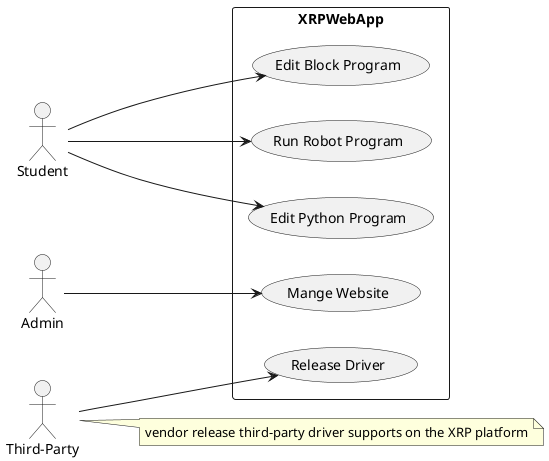
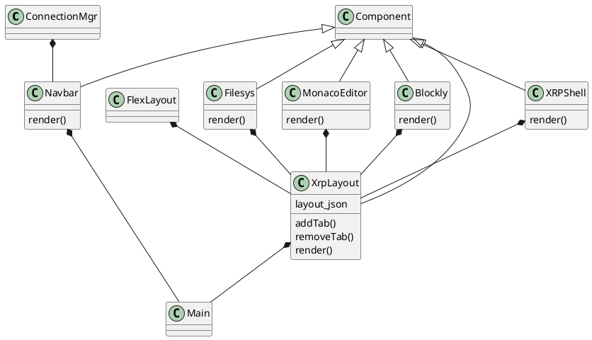
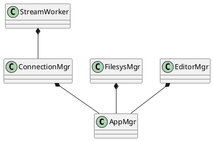
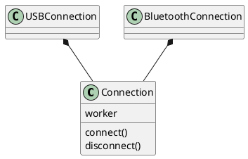
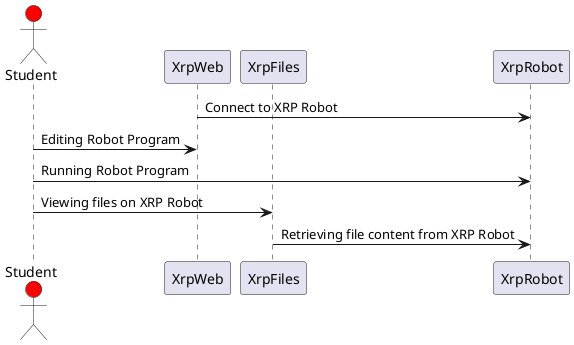

# Introduction

XRP ofers a flexible and adaptable platform that allows students to learn about robotics, programming, and engineering concepts at their own pace and it also enables STEM education accessible to a wider range of students, regardless of their background or location.

In addition, the goals are to inspire and empower young people to pursue careers in STEM fields through hands-on, engaging robotics experiences. Encourage students to work together to solve challenges and develop innovative solutions and an cooperative environment where students can fosther grow individually and professionally.

The student uses this Web application platform along with the XRP Robot to perform their programming, troubleshooting and experimentation tasks.

## Scope

Sparkfun manages the development of the XRP controller board in collaboration with WPI and community volunteers. The XRP Web application is a collaboration between WPI and community volunteers. This document describes the software architecture of the XRP software platform including both the Web application and the firmware release to the XRP hardware platform. 

# Software Architecture

## Quality Attributes

The software architecture intends to focus on the following architecture principles.

- Maintainability
- Testability
- Extendability
- Adaptability
- Developability

## Constraints

The XRP software architecture shall embrace the software component design patterns and declarative user interface paradigm to enhance code readability and maintainability.

The XRP platform is an Open Source and it is not a for profit software product. The development environment leverages mostly Open Source software development tools such as Visual Studio Code and Micro Python and Open Source software libraries.

Vite and React can satisfy both the software component design pattern and declarative user interface design paradigm.

## Use Cases

The diagram below depicts the use cases for the XRP Web Development Application.



## Technology

This software architecture specifies the following technology stack for development.

- Vite Development framework and React User Interface framework
- Typescript programming language
- HTML/CSS (Tailwindcss)
- Web browser serial protocol
- JSON
- Bluetooth (BLE) protocol
- HTTPS protocol

## Context

Experiemential Robotics Platform (XRP) is a learning platform consists of the XRP hardware that is based on Sparkfun's [controller](https://www.sparkfun.com/products/22727) board and XRP software development environment for writing software for the XRP.

```plantuml
@startuml "enterprise"
!include https://raw.githubusercontent.com/plantuml-stdlib/C4-PlantUML/master/C4_Context.puml
' uncomment the following line and comment the first to use locally
' !include C4_Context.puml

LAYOUT_TOP_DOWN()
'LAYOUT_AS_SKETCH()
LAYOUT_WITH_LEGEND()

Person(user, "User", "XRP user, typically a student.")

Enterprise_Boundary(c0, "XRP") {
    Person(csa, "XRP Admin", "XRP Web Administrator")

    System(xrpdev, "XRP Web App", "Allow XRP users to write robotics program for the XRP on the XRP website.")
}

System(XRPBot, "XRP Robot", "XRP Hardware platform.")

Rel_R(user, csa, "Asks questions to", "Email, Discord")

Rel_R(user, xrpdev, "develope software for the XRP.")

Rel_R(user, XRPBot, "student run software on the XRP robot")

Rel(csa, xrpdev, "manage XRP Web deployment and maintainance of XRPWeb")

Rel_R(xrpdev, XRPBot, "Update XRP or Run the robot program")

@enduml
```

## Containers

The XRP hardware platform is a afordable hardware kit that consists of the following components. The kit is retail for $114.95. Sparkfun.com offers discount to FIRST teams.

- Sparkfun [controller](https://www.sparkfun.com/products/22727) board
- XRP chassis set
- Ultrasounic Distance Sensor
- Servo (sub-micro size)
- Hobby Motor with encoder
- Caster wheel
- O-Ring
- flexible Qwiic Cable - Female Jumper (4-pin) with Heat Shrink
- Battery holder
- Custom Line Follower board
- XRP Sticker Sheet

```plantuml
@startuml "messagebus"
!include https://raw.githubusercontent.com/plantuml-stdlib/C4-PlantUML/master/C4_Container.puml

SHOW_PERSON_OUTLINE()

Person(user, "User", "XRP user, typically a student.")

System_Boundary(c1, "XRP Platform") {
    Container(xrp, "XRP Platform", "XRP Hardware", "Allows users to experiement the XRP platform")
    Container(xrp_kernel, "XRP Kernel", "XRP Micro-Python", "Provides an OS and runtime environment")
    Container(xrp_motion, "XRP Actuators", "XRP motion hardware", "Provides mechanical motion capability")
    Container(xrp_sensors, "XRP Sensors", "XRP sensing capability", "Provides sensing capability to enhance the robot")
    Container(xrp_power, "XRP Battery Pack", "XRP power", "Provides power to the platform")
}

Rel_D(user, xrp, "Uses", "hardwrae")
Rel_D(xrp, xrp_kernel, "Execute", "Python")
Rel_D(xrp_kernel, xrp_motion, "Mobility", "actuators")
Rel_D(xrp_kernel, xrp_sensors, "Sensing", "Sensors")
Rel_D(xrp, xrp_power, "Power", "Battery")


SHOW_LEGEND()
@enduml
```

The XRP software platform (XRP Web development environment) provides the students environment where they can write robot program in block or Python programs.

```plantuml
@startuml
@startuml
!include https://raw.githubusercontent.com/plantuml-stdlib/C4-PlantUML/master/C4_Container.puml
!define DEVICONS https://raw.githubusercontent.com/tupadr3/plantuml-icon-font-sprites/master/devicons
!define FONTAWESOME https://raw.githubusercontent.com/tupadr3/plantuml-icon-font-sprites/master/font-awesome-5

LAYOUT_WITH_LEGEND()

Person(user, "User", "XRP user, typically a student.")
Person(csa, "XRP Admin", "XRP Web Administrator")

title Container diagram for XRP Web

System_Boundary(c1, "XRP Web IDE") {
    Container(web_app, "Web Application", "Typescript, React", "Provides an interactive environment to develop robot program")
}

System_Ext(xrp, "XRP Platform", "The XRP Robot Platform")

Rel(user, web_app, "uses", "HTTPS")
Rel(csa, web_app, "uses", "HTTPS")
Rel_D(web_app, xrp, "", "")

@enduml
```

## Components

The software components are the major features of the system where they are grouped distintively and their relationship between components are specified. Each component can be developed independently and each have interface specification between them.

```plantuml
@startuml
!include https://raw.githubusercontent.com/plantuml-stdlib/C4-PlantUML/master/C4_Component.puml
' uncomment the following line and comment the first to use locally
' !include C4_Component.puml

LAYOUT_WITH_LEGEND()

title Component diagram for XRP Web Development Application

System_Ext(xrp, "XRP Platform", "The XRP Robot Platform")

Container_Boundary(xrpweb, "XRP Web Development Application") {
    Component(main, "Application", "Initalize system")
    Component(repl, "USB or Bluetooth connection", "Allows XRP Web Application to connect to the XRP Robot Platform")
    Component(nav, "Application Navigation", "Provides application navigation")
    Component(layout, "React Flexlayout", "Allows XRP Web to define application layout")
    Component(editor, "Integrated Editor (Monaco)", "Allows XRP to provide Python source oediting environment")
    Component(block, "Block Editor (Blockly)", "Allows the user to edit block programs")
    Component(filesys, "File System", "Provides access to XRP file system")
    Component(runtime, "Initate Runtime", "Start Robot program in the XRP Platform")

    Rel(main, layout, "Initialize Layout", "Create the application layout")
    Rel(main, nav, "Initalize Navigation", "Create application navigation")
    Rel(repl, xrp, "Uses", "Serial interface to XRP Platform")
    Rel(nav, filesys, "Uses", "View, navigate file systems")
    Rel(nav, repl, "Connect", "Connect to the XRP Platform")
    Rel(nav, editor, "Python Source", "Allow user to edit Python program")
    Rel(nav, block, "Block Source", "Allow user to edit block program")
    Rel(nav, runtime, "Run Program", "Run Robot Program")
    Rel(runtime, xrp, "Run Program", "Running Robot Program")
}
@enduml
```

## Codes

This section documents the major classes which are based on the React Component class.

### React Components



### Application Components

The application components manages the core functionality of the following features.

- Application Management
- Connection Management (Cable and Bluetooth)
- File Management (User and System Filesystem)
- Editor Session Management



### Connections

There are two type of connections in the system, i.e., USB or Bluetooth. The connection classes provide interfaces to connect or disconnect and handle the communication between the Web Application and the XRP Robot. Once the connection is established, data transfer from the connection objects to file system manager is handled through publish and subscribe interfaces.



## Run Time View

The figure below depicts the runtime view of the system when the users are interacting with the system.



## Deployment View

The figure below depicts the how the Web application is deployed.

```plantuml
@startuml
  !include https://raw.githubusercontent.com/plantuml-stdlib/C4-PlantUML/master/C4_Deployment.puml

AddElementTag("fallback", $bgColor="#c0c0c0")
AddRelTag("fallback", $textColor="#c0c0c0", $lineColor="#438DD5")


title Deployment Diagram for XRP Web Development Application

Deployment_Node(xrpwebserver, "XRP Server Infrastructure", "WPI Server Farm"){
    Deployment_Node(dn, "WPI Web server", "Ubuntu 16.04 LTS"){
        Deployment_Node(apache, "Apache Tomcat", "Apache Tomcat 8.x"){
            Container(xrpWeb, "XRP Web Server", "Vite & React", "Provides Integrated Robot Software Development")
        }
    }
}


Deployment_Node(comp, "Customer's computer", "Microsoft Windows or Apple macOS"){
    Deployment_Node(browser, "Web Browser", "Google Chrome, Mozilla Firefox, Apple Safari or Microsoft Edge"){
        Container(xrpserver, "Single Page Web Application", "Vite & React", "Provides Integrated Robot Software Development")
    }
}

Rel(xrpserver, xrpWeb, "Makes Https requests to server", "json/HTTPS")

SHOW_LEGEND()
@enduml
```

## Architecture Decisions

Vite and React was choosen as the user interface development framework as they are supported by the Open Source community as well as companies like Facebook and Vercel. Both are respected UI framework which are used by a large development comminity.

## Quality Requirements

The XRP Web Development application is developed and meet the following quality requirements.

- Unit Tests
- End to End Test

## Security Requirements

XRP Web Development application is hosted in a server farm at WPI. Https secured protocol is used. A valid server HTTP server certificate is configured for the XRPCode subdomain.

## Ricks

The following list a potential list of risks.

- Open Source software library packages are out of date and their associate repositories are lack of maintainance.
- Lack of future volunteer developers to support the project